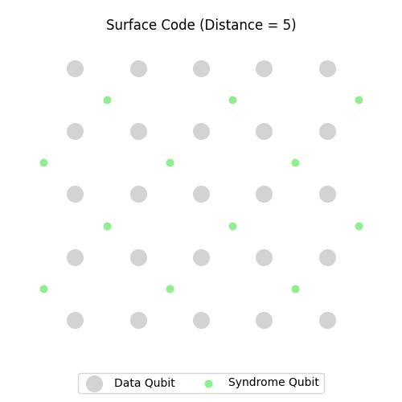
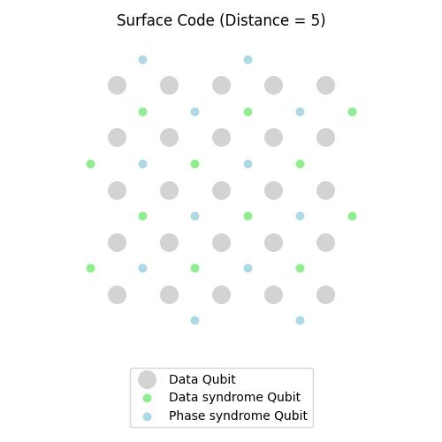
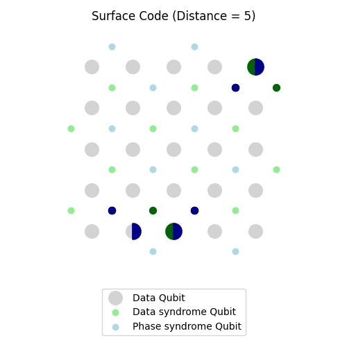

# TransformerQEC

[](https://www.python.org/)
[](https://shields.io/)

> An unofficial implementation of [Transformer-QEC: Quantum Error Correction Code Decoding with Transferable Transformers](https://arxiv.org/abs/2311.16082)

## Install Requirements

```bash
pip install -r requirements.txt
```

## Surface Code Simulation

> More details [here](data_generation/README.md) | code: [data_generation/surface_code.py](data_generation/surface_code.py)

This project provides two classes for simulating surface codes in quantum error correction:

### MinimalSurfaceCode

Simulates X errors in a surface code.

```python
code = MinimalSurfaceCode(distance=5)
code.plot_surface_code()
```

### SurfaceCode

Extends MinimalSurfaceCode to simulate both X and Z errors.

```python
code = SurfaceCode(distance=5, min_q_err=2, prob_err=0.05)
code.plot_surface_code()
```

|                         MinimalSurfaceCode                         |                              SurfaceCode                              |                        SurfaceCode with errors                        |
| :----------------------------------------------------------------: | :-------------------------------------------------------------------: | :-------------------------------------------------------------------: |
|  |  |  |

Both classes provide methods to generate error patterns, calculate syndromes, and visualize the surface code layout.

#### Key Features
- Customizable code distance and error probabilities
- Syndrome calculation
- Visualization of qubits, errors, and syndrome measurements

## Overview

 - **Quantum Data Generation**: The Python script (`data_gen.py`) generates synthetic data for quantum error correction experiments. It leverages the stim_experiments module for quantum circuit simulation and various utility functions for encoding, decoding, and data processing. Uses `DISTANCE` and `SHOTS` from config.

 - **Data Preparation**:The `data.py` is a Python script designed to prepare input and output tensors for quantum error correction experiments. It includes functions for decoding and preprocessing data from a CSV file generated by a quantum error correction circuit.

- **Configurations**: `config.yaml` specifies parameters for QEC data genetation, data-prep for model training, transformer-model, etc.

- **Tranformer Model**: `transformer_model/model.py`
    - This file contains implementations of various components for building Transformer models.
    - `Transformer` is the main model for sequence-to-sequence tasks using the Transformer architecture.
    - Encoders**:
            - `transformer_encoder_model`: builtin transformer encoder from pytorch
            - `MultiSelfAttention` is a module that implements multi-head self-attention for Transformer models.
            - `TransformerBlock` is a module representing a single block within the Transformer architecture. 

- **Lightning Transformer**: `lightning_module.py`
    - The `LightningTransformer` class inherits from `pytorch_lightning.LightningModule` and is designed for binary classification tasks using Transformer models. The model is trained using BCEWithLogitsLoss with optional class weighting.
    - **Weighted Accuracy and F1 Score**: The `weighted_acc` method calculates the Weighted Accuracy and F1 Score based on a confusion matrix. Adjust the `weights` parameter for class weighting and the `thresh` parameter for thresholding probabilities.

- **Training**: `train.py`
    1. **Configuration Loading**: Load configuration parameters from a YAML file (`config.yaml`) to set up data paths and model parameters.

    2. **Data Loading**: Read data from the last generated CSV file using Polars and create a dataset using `QuantumSyndromeDataset`. Split the dataset into training, validation, and test sets using PyTorch `random_split`.

    3. **DataLoaders**: Create PyTorch `DataLoader` instances (`train_dl`, `val_dl`, `test_dl`) for the training, validation, and test datasets.

    4. **Model Definition**: Define the Quantum Syndrome Classification model using the `LightningTransformer` class.

    5. **Training Setup**: Configure training settings, including callbacks such as `EarlyStopping` and loggers like `CSVLogger`.

    6. **Training**: Train the model using the PyTorch Lightning Trainer (`trainer`). The training process includes monitoring validation loss, logging metrics, and early stopping.
        ```bash
        python train.py
        ```
    
    7. **Checkpoints and Logs**: Monitor training progress through checkpoints saved in the `checkpoints/` directory and logs in the `logs/` directory.
            
- **Validation**: `valid.py`.
    1. Put the checkpoint path in the `config.yaml` with label "CHECKPOINT".
    2. Assuming all other parameters are same as that used in training. If not, change it accordingly.
    3. run
        ```bash
        python valid.py
        ```

## Usage

After setting the configuration file, execute the following command for data generation:

```python
python data_gen.py
```
This will generate synthetic data for quantum error correction experiments, including syndromes and errors. The data will be stored in CSV files in the specified dataset directory.

And run the following command for training the transformer model on the generated data:
```python
python train.py
```
The checkpoints are saved to the `checkpoints/` directory, and the logs are saved to the `logs/` directory.

## Additional Notes

- The number of parallel executions is set to half of the available CPU cores for efficiency.
- The `get_n_shots` function generates and stores data for multiple shots of a quantum error correction circuit in parallel, leveraging Ray for parallelism.
- **Weighted Accuracy and F1 Score**: The `weighted_acc` method calculates the Weighted Accuracy and F1 Score based on a confusion matrix. Adjust the `weights` parameter for class weighting and the `thresh` parameter for thresholding probabilities.