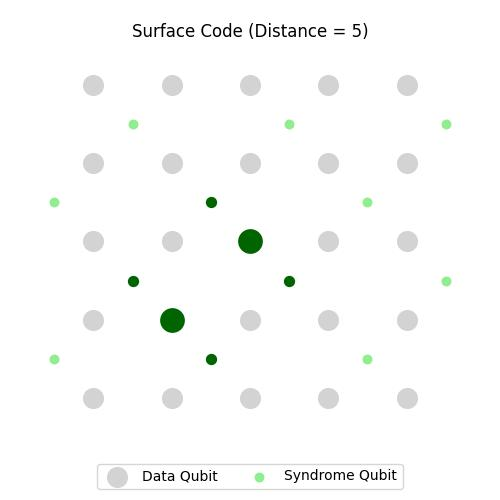
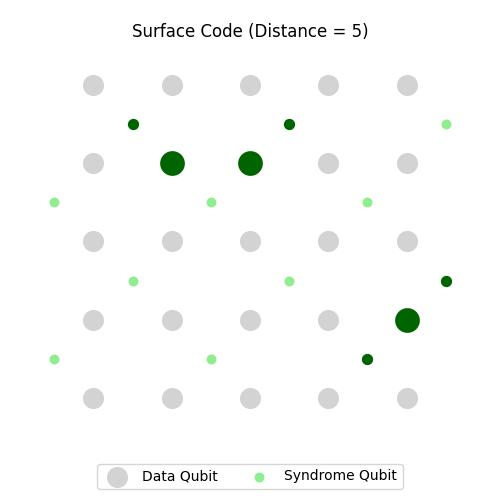
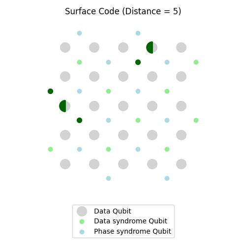
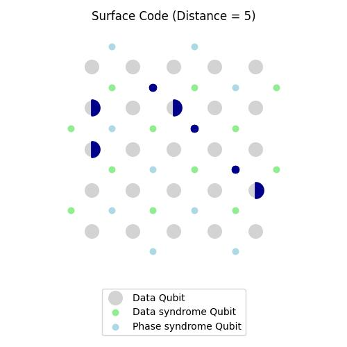

## Surface Code Simulation `surface_code.py`

### class `MinimalSurfaceCode`

> A Python class for simulating and visualizing simplified surface codes in quantum error correction.

|                    Surface Code                    |              With Errors (example 1)               |              With Errors (example 2)               |
| :------------------------------------------------: | :------------------------------------------------: | :------------------------------------------------: |
|  |  |  |

#### Features

- Generate surface codes with custom distances
- Simulate X errors (translatable to Z errors with rot90)
- Calculate syndrome measurements
- Visualize the surface code layout

#### Quick Start

```python
from minimal_surface_code import MinimalSurfaceCode

code = MinimalSurfaceCode(distance=5, min_q_err=2, prob_err=0.05)
code.plot_surface_code()
```

#### Visualization Key

- Black circles: Data qubits
- Green dots: Syndrome qubits
- Red circles: Errors on data qubits
- Red dots: Non-zero syndrome measurements

Customize error generation by modifying `min_q_err`, `prob_err` parameters in __init__ method.

---

### class `SurfaceCode`

> Extends MinimalSurfaceCode to simulate both X and Z errors in surface code quantum error correction.
> `round` parameter not used.

|                     Surface Code                      |                   With data errors                    |                   With phase errors                   |                   With both errors                    |
| :---------------------------------------------------: | :---------------------------------------------------: | :---------------------------------------------------: | :---------------------------------------------------: |
|  |  |  |  |


#### Quick Start
```python
from  surface_code import SurfaceCode

code = SurfaceCode(distance=5, rounds=5, min_q_err=2, prob_err=0.05)
code.plot_surface_code()
```

#### Features

- Simulates data (X) and phase (Z) errors
- Calculates separate syndromes for both error types
- Visualizes complete surface code layout

#### Visualization Key

- Gray circles: Data qubits
- Green dots: Data syndrome qubits
- Blue dots: Phase syndrome qubits
- Green left-filled circles: Data errors
- Blue right-filled circles: Phase errors
- Colored dots: Non-zero syndrome measurements

## Contributing

Contributions to improve the simulation or extend its capabilities are welcome. Please feel free to submit issues or pull requests.

## Contact

Shubham Kaushal

[Github](https://github.com/shubhamkaushal765) | [LinkedIn](https://www.linkedin.com/in/kaushalshubham/)